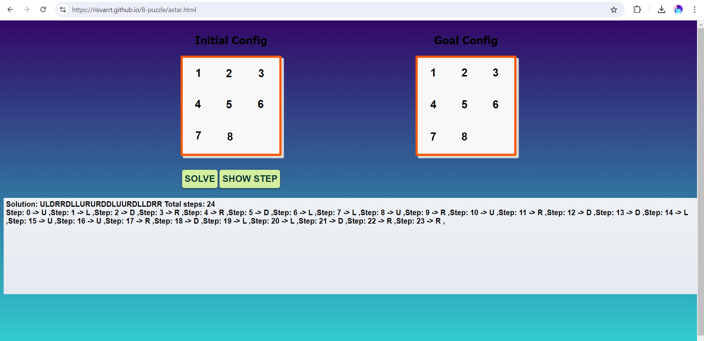
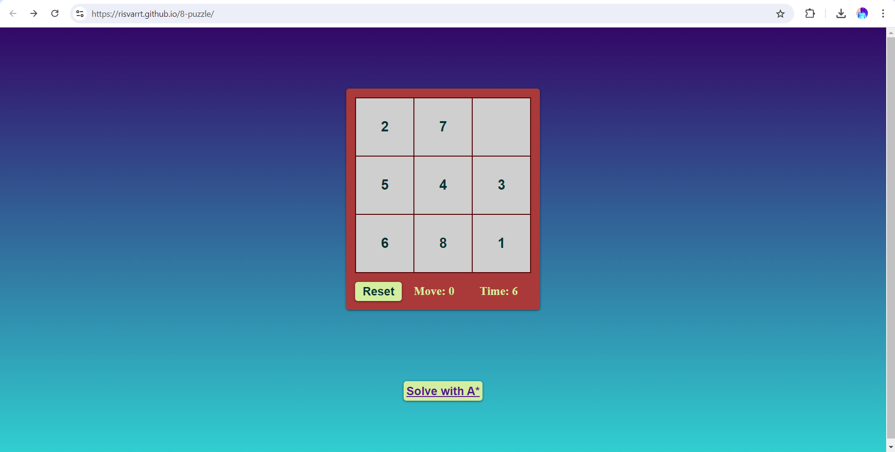

# 8-Puzzle Game

This project is an implementation of the 8-puzzle game using the A* (A-star) search algorithm. The game allows users to play the 8-puzzle game and also provides a feature where the game can be solved using the A* algorithm.

## Project Links

- **Home Page**: [8-Puzzle Game](https://risvarrt.github.io/8-puzzle/)
- **A* Algorithm Page**: [Solve with A*](https://risvarrt.github.io/8-puzzle/astar.html)

## Features

- **Play the Game**: Users can manually solve the 8-puzzle game by moving the tiles.
- **Solve with A***: Users can see the solution generated by the A* algorithm.

## Screenshots

### Home Page


### A* Algorithm Page


## How to Use

1. **Clone the repository**:
   ```bash
   git clone https://github.com/risvarrt/8-puzzle.git
   ```
2. **Open the index.html file in your browser** to start playing the game.

## A* Algorithm Overview

The A* (A-star) algorithm is a popular search algorithm used for pathfinding and graph traversal. It is known for its efficiency in finding the shortest path between nodes, which in the context of the 8-puzzle game, translates to finding the sequence of moves that will solve the puzzle with the least number of moves.

### How it Works:

- **Heuristic Function**: The algorithm uses a heuristic to estimate the cost of reaching the goal from a given state. The heuristic used in this project is the **Manhattan Distance**, which is the sum of the distances of the tiles from their goal positions.
- **Priority Queue**: States are explored in the order of their estimated cost to reach the goal. The state with the lowest estimated cost (heuristic + actual cost) is explored first.
- **Optimal Solution**: The A* algorithm is guaranteed to find the optimal solution if the heuristic is admissible (never overestimates the cost).

## Technical Details

### Tech Stack

- **HTML5**: The structure of the web pages is built using HTML.
- **CSS3**: The styling of the web pages is done using CSS, ensuring a clean and responsive design.
- **JavaScript (ES6)**: 
  - **Core Logic**: The game logic, including the tile movements and state management, is implemented in JavaScript.
  - **A* Algorithm**: The A* algorithm is implemented in JavaScript, specifically in the `astar.js` file.
- **GitHub Pages**: The project is hosted on GitHub Pages, making it easily accessible online.

### Project Structure

- **index.html**: The main page where users can manually play the 8-puzzle game.
- **astar.html**: The page where users can observe the puzzle being solved by the A* algorithm.
- **style.css**: Contains all the CSS styles used across the web pages.
- **script.js**: Contains the game logic for manual play, including functions for tile movement and checking the win condition.
- **astar.js**: Implements the A* algorithm, including the priority queue management and heuristic calculation.
- **assets/**: This folder contains the images and other assets used in the project.

### Key Functions

- **moveTile(tile)**: Handles the logic for moving a tile when clicked, updating the puzzle state.
- **isSolvable(puzzle)**: Checks whether the current puzzle configuration is solvable.
- **aStarSolver(puzzle)**: Uses the A* algorithm to find the shortest sequence of moves to solve the puzzle.
- **manhattanDistance(puzzle)**: Calculates the Manhattan Distance for the current puzzle state.


